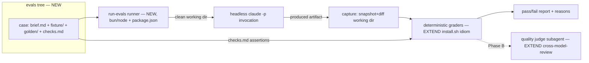

# TD Evals harness for the skill library (Phase A — assertion-first)

| | |
|---|---|
| **Summary** | An in-repo `evals/` harness that runs the library's own skills headless against sanitized reference cases and grades both output quality and human-gate preservation. |
| **Owner** | Adam Higginson |
| **Date Created** | 2026-06-26 |
| **Jira Link** | N/A |

> **DRAFT — assisted draft, pending human review and risk acceptance.** Drafted
> with assistance from the architect pipeline. The Security Considerations sizing
> and checklist entries below are **proposals**, not acceptances — a named owner
> ticks and accepts them. `[gap]` marks a point the source brief was silent on; an
> architect must resolve it, not assume it. This is a **framed** TD: Goals, Context,
> NFRs, Assumptions, Standards and a recommended direction are filled; Architecture,
> API, and Security Considerations come from the later pipeline steps.

## Approach & key decisions

- **Chosen approach** — Approach A (assertion-first harness): an `evals/` tree, a
  headless skill runner, deterministic gate + structural graders, manual quality read
  against a sanitized golden. Chosen over the full two-grader harness (Approach B) so
  the load-bearing mechanic (headless run + artifact capture + gate-halt detection) is
  proven before any LLM-judge/CI investment; Approach B is the documented roadmap.
- **Shape of the change** — **New:** `evals/` case tree + a runner + deterministic
  graders. **Reuses:** the house templates (gate fields are template-defined), the
  `_standards/` control IDs (the assertion vocabulary), the `cross-model-review`
  subagent pattern (for Phase B's judge). No change to the `publish-bundle` release
  pipeline in Phase A.
- **Key decisions** — (1) One verdict, two grader mechanisms (deterministic gates now,
  LLM-judge quality later). (2) Reference cases are **sanitized/synthetic**, never raw
  signed-off GDS artifacts (public repo). (3) Grade the **output, not the path**, with
  one acknowledged exception (the trace-derived `halted-at-gate` check). (4) Start with
  `check-security-standards` + `threat-model`; defer `generate-design-doc` until the
  fixture model is proven. (5) Spike the headless mechanic first as a go/no-go.
- **Open questions / `[gap]`s blocking sign-off** — none blocking (owner = Adam
  Higginson; NFRs confirmed N/A as a dev tool; `.claude/standards/` register out of
  scope for now). Still to resolve in design/build: where each skill's "gate contract"
  lives (lean SKILL.md frontmatter), and the spike's three go/no-go sub-questions. See
  Assumptions.

## Goals

Give the library a **repeatable regression signal** so that a change to a skill's
prompt, the underlying model, or a standard under `_standards/` cannot silently
degrade a skill's output quality or erode its human-approval gates without being
caught. Formalize the manual "validate against approved work" loop that
`CLAUDE.md` step 5 already describes informally.

## Context

The library is a set of assurance-critical skills (`threat-model`,
`check-security-standards`, `generate-design-doc`, etc.) that UK government teams rely
on to produce security and engineering artifacts. Today there is no repeatable way to
know when a change degrades a skill's output. Validation is the manual, by-hand
process in `CLAUDE.md` ("Validate against real, already-approved work… The misses are
the iteration backlog") — not repeatable, not version-controlled, not run on change.

For an assurance library the more dangerous regression is not a mediocre artifact but
a skill that **stops deferring to a human** — sets its own security sizing, ticks a
checkbox a human should tick — silently. This TD formalizes the validation loop into a
harness that grades both halves.

This work is itself a real engineering change to **this** repo, and is intentionally
being taken through the library's own architect pipeline (dogfooding). The full
office-hours framing and approach selection were done in a prior session; this TD ports
that into the house format. See Supporting Documentation.

**Trust boundary / inherited platform.** The change introduces a repo-local runner and
an `evals/` tree. The **GitHub repo, PR/review rules, GitHub Actions CI, and the
`publish-bundle` release pipeline are inherited platform** — cited, not re-modelled.
Phase A adds nothing to CI; Phase B adds a CI job that *runs on* that inherited
platform. The eval runner does invoke `claude` headless locally, which is a new
execution surface to scope in the security step.

## Non-functional requirements & success criteria

This is a developer/CI tool, not a production service, so several NFRs are N/A by
nature — confirm at the gate.

- **Scale / load** — N/A (runs over ~10-15 cases on demand, not a served workload).
- **Performance** — Each case is a full skill run (minutes + token cost) × `k` runs ×
  ~10-15 cases, so a full Phase A pass is a coffee-break operation. The envelope, not a
  latency target, is the constraint; it informs why CI gating waits for Phase B.
- **Availability / resilience** — N/A (no uptime requirement).
- **Security & privacy posture** — Low, but non-zero: the runner executes `claude`
  headless and reads repo files; the **leak risk is the real control** — sanitized
  reference cases only, no raw GDS architecture in the public repo. Detailed by the
  security step.
- **Accessibility** — N/A (no user-facing UI).
- **Success criteria** —
  - A runner that, given a case folder, executes the target skill headless on
    `brief.md`, captures the artifact, runs `checks.md`, emits pass/fail with reasons.
  - Deterministic gate + structural graders **green on the golden, red on a planted
    regression** (e.g. a skill variant that auto-ticks a gate). This proves the eval
    itself works.
  - 2-3 skills × ~5 sanitized cases committed under `evals/`.
  - Runs locally via one command; CI wiring documented as the next phase, not built.
  - `docs/authoring.md` updated to point at the harness as the formalized step-5
    validation; `CHANGELOG.md` note added; an **`evals/` README / runbook** (how to run
    `run-evals`) added (GDSW-OPS-3).
  - **Coverage commitment (GDSW-TEST-1) is deferred** to `plan-and-implement`: the
    *case bar* (2-3 skills × ~5 cases, k=3) is committed here; a numeric *code-coverage*
    bar for the runner/grader code is an open commitment recorded in the Decision log,
    to be set at plan time (the planted-regression self-test is the Phase-A floor).

## Options Considered

### Option 1 — Assertion-first harness (Proposed)

`evals/` case tree (`brief.md` + sanitized `golden/` + declarative `checks.md`); a
runner invokes the skill headless and runs deterministic gate + structural graders;
quality is a manual human read against the golden.

**Pros**
- Proves the load-bearing mechanic (headless run + capture + halt-detection) first.
- Ships deterministic gate-regression protection live; smallest diff.
- Defers the genuinely hard LLM-judge.

**Cons**
- Quality half stays manual until the judge is added (Phase B).

**Risks**
- [Medium] Headless skill invocation + gate-halt detection is unproven (spike first).

### Option 2 — Full two-grader harness (Proposed — as the Phase B roadmap, not now)

Option 1 plus an LLM-judge quality grader (a fresh on-machine subagent, the
`cross-model-review` pattern), a human-calibration loop, CI wiring (gate-grader blocks
PRs touching `skills/` or `_standards/`; quality-grader advisory), and `pass^k`
consistency runs.

**Pros**
- Both halves of "one bar" automated; catches quality regression without a human.
- Calibrated, defensible as assurance evidence.

**Cons**
- Builds judge-calibration and CI infra before the basic pipeline is proven.

**Risks**
- [Medium] Judge calibration is fiddly; headless reliability still required.

### Option 3 — Eval-as-a-skill (Dismissed)

Make evaluation a library skill that grades a skill's output using the library's own
machinery (cross-model-review subagent, check-* pattern, gated walk-back).

**Pros**
- Maximally on-brand; evals become first-class library citizens.

**Cons**
- An assurance eval wants a grader **more** deterministic and independent than the
  thing it grades; building it from the same interactive, gated, non-deterministic
  machinery is backwards. A code assertion is a better regression gate than a skill.

**Risks**
- [High] Couples eval reliability to skill-invocation determinism; fights CI.

**Dismissed because** the determinism argument is disqualifying for a regression gate.

## Constraints

- **Sanitized/synthetic reference cases only** — no raw signed-off GDS artifacts in the
  public `govuk-one-login` repo.
- **Evals live in-repo**, a first-class peer of `_standards/` and `_templates/`.
- **Grade the output, not the path** — assert on artifact content, never exact wording
  or tool-call sequence. One acknowledged exception: the trace-derived
  `halted-at-gate` check, kept in its own grader class and not called deterministic.
- **Single source of truth** — checks cite control IDs / template field names; never
  re-encode standards text.
- **Skills are interactive and human-gated** — the harness runs them headless and must
  treat "stopped at a gate" as a captured signal, not a hang.
- **Start narrow** — 2-3 skills, ~5 cases each, not all 25.

## Assumptions & open questions

- **Assumption:** Real signed-off artifacts with their original briefs exist and can be
  sanitized into reference cases — owner Adam Higginson, to confirm sanitization sign-off.
- **Assumption:** A skill can be invoked headless (`claude -p` / print mode) in a clean
  working dir with output captured to a known path — owner Adam Higginson, **to validate
  by spike** (this is the load-bearing unknown).
- **Open question:** Where does each skill's machine-checkable "gate contract" live —
  SKILL.md frontmatter (leaning this) or the eval case's `checks.md`?
- **Open question:** First 2-3 skills — provisional `check-security-standards` +
  `threat-model` (structurally checkable, context-light); `generate-design-doc`
  deferred until the fixture model is proven.
- **Open question:** Runs-per-case threshold — provisional `k=3` all-green for gate
  assertions; revisit on observed flakiness.
- **Open question:** Who authors and signs off sanitized cases as representative.
- **Spike / POC needed:** Headless skill invocation must answer three go/no-go
  sub-questions before the rest is built — (a) artifact **capture** (explicit
  output-path arg vs runner snapshots-and-diffs the working dir); (b) non-interactive
  **permissions** posture (allowlist vs skip-permissions in a sandboxed clean dir);
  (c) **halt-detection** — distinguishing a correct gate-halt from completion, crash,
  or assumed-approval in print mode.

## Architecture

> Architecture / module / contract level only. Internal runner function design,
> file-by-file structure, and low-level test contracts are `plan-and-implement`'s job
> per story.

Four components. **Language (GDSW-LANG-1):** the runner/graders are **Node.js /
TypeScript run on `bun`** — Node.js/TS is in the GDS-supported set; `bun` is the
committed runtime (already required by the dev toolchain). This is a **deliberate
departure** (AD1) from the repo's existing bash+jq script idiom (`scripts/build-bundle.sh`),
chosen for structured grading logic and YAML-authored checks. What carries over from
the repo is a **pattern, not the language**: the graders apply the same grep/parse
property-assertion *idea* as the `install.sh` drift guards, reimplemented in TS.

**Reused / extended / new**
- **Reused (unchanged):**
  - `skills/_templates/*.md` — the gate-field markers (the sizing `[ ]` rows; the
    Threat-Modeling `[ ] Completed (Ref ID) [ ] Scheduled (Date) [ ] Not Required`
    row; `[ ] Yes / [ ] No` rows; the Decision-log columns) are the **assertion
    vocabulary** the `gate-field-state` grader parses. The harness reads them; it does
    not change them.
  - `skills/_standards/**` control IDs — the vocabulary for the `control-id-present`
    grader. Unchanged.
- **Extended (pattern, not the file):**
  - The **`install.sh` verification idiom** — grep/parse property assertions over the
    tree, emitted as non-fatal findings (the `deep:`-pointer drift guard, the
    composite-in-`flows.md` check). The deterministic graders apply the same idiom to
    skill *output artifacts*. (Conceptual reuse — the graders live in their own file,
    `install.sh` is not edited.)
- **New:**
  - **Eval case tree** `evals/<skill>/<case>/` — `brief.md` (+ `fixture/` for
    context-heavy skills) + `golden/` (sanitized reference) + `checks.md` (declarative
    YAML assertions).
  - **Eval runner** — for each case: prepares a clean working dir, invokes the target
    skill headless, captures the produced artifact, runs the graders, aggregates
    pass/fail. **A small bun/node runner** (AD1 decided): introduces the repo's first
    `package.json` + runtime dependency, chosen for cleaner structured grading logic
    and YAML-authored `checks.md`. `bun` is already required by the dev toolchain, so
    the marginal cost is the `package.json`, not a new install.
  - **Deterministic graders** — one per `checks.md` assertion type:
    `control-id-present`, `gate-field-state`, `no-inlined-standard` (all static,
    output-only), and `halted-at-gate` (trace-derived — the one acknowledged P5
    exception, in its own grader class).
  - **Headless invocation + capture** — the load-bearing unknown (Assumptions spike).
    Skills pick contextual output paths, so capture leans toward **snapshot-and-diff
    the clean working dir** rather than relying on a fixed path; resolved by the spike.

### Infrastructure

N/A in Phase A (repo-local runner; no new cloud resources). Phase B adds a GitHub
Actions job that **extends** the existing `.github/workflows/` setup (precedent:
`publish-bundle.yml`), running the gate graders on PRs touching `skills/` or
`_standards/`. Inherited CI platform — cited, not re-modelled.

### Mobile modules

N/A.

### Test approach

- **Test infrastructure (reuse / extend / new)** — **New.** The repo today has **no
  test/ dir and no test runner** (CI is publish-only). This harness *is* the repo's
  first test infrastructure; there is nothing to reuse. With the bun/node runner
  (AD1), the graders themselves can be unit-tested with `bun:test` — so the new
  toolchain doubles as the graders' own test framework. The harness's end-to-end
  correctness is proven by a **planted-regression fixture**: a deliberately broken copy
  of a skill (e.g. one that auto-ticks a sizing box a human should tick) that the
  graders MUST catch. A grader that stays green on the planted regression is itself
  broken.
- **Coverage commitment** — Not code-coverage. The Phase A bar is **2-3 skills × ~5
  sanitized cases**, with each gate assertion green on the golden across `k=3` runs and
  red on the planted regression. Widening to more skills is the post-Phase-A backlog.

## API design & contracts

> Public/contributor-facing contract only. Internal runner module interfaces are
> `plan-and-implement`'s job, per story.

The contributor-facing contract is the **eval case format** and the **`checks.md`
assertion schema** — other contributors author cases against these, so they are the
stable surface:

| Contract | Shape | Notes |
|----------|-------|-------|
| Case layout | `evals/<skill>/<case>/{brief.md, fixture/?, golden/, checks.md}` | `fixture/` only for context-heavy skills (a synthetic project the skill sees) |
| `checks.md` schema | YAML list of typed assertions | Types (Phase A): `control-id-present` (ids: [...]), `gate-field-state` (field, must_be), `no-inlined-standard`, `halted-at-gate` (gate) |
| Runner CLI | `run-evals <skill>[/<case>]` → pass/fail + per-check reasons, non-zero exit on fail | Exact flags are `plan-and-implement`'s detail |

**Shared-contract change control (GDSW-API-1).** The `checks.md` assertion schema is a
**shared contract** other contributors author against. A **breaking** change to it
(removing or renaming an assertion type) is **change-controlled — it requires TD
approval**, not a plan-time or implement-time decision. Versioning + deprecate-then-remove
(GDSW-API-2/4) are **deferred** while there are no external case authors yet; the intent
is recorded so it isn't lost.

### Infrastructure

(see Architecture › Infrastructure)

## Considerations

- **Deployment** — N/A (no deploy).
- **Dependencies / supply chain (GDSW-LANG-3 eng half; A03:2025 security)** — AD1
  introduces the repo's **first `package.json`**. Commit: dependencies **pinned with a
  lockfile and scanned in the gate**; kept minimal (bun stdlib where possible). The
  security supply-chain row is owned by the Security Considerations checklist above.
- **Egress (PLAT-5 / NCSC CP11)** — The tool's **one declared egress**: the headless
  `claude` invocation calls the Anthropic API, sending the case `brief` + `fixture`
  content. Permitted because that content is **sanitized/synthetic** (the governing
  control). The Anthropic API is pre-existing at org level (inherent to Claude Code),
  not a net-new integration.
- **Platform components (PLAT-2)** — recorded components: `bun`/Node + the dependency
  set (new surface), and the Anthropic API (pre-existing). No cloud resources in Phase A.
- **Platform change surface (PLAT-6)** — does **not** fire in Phase A (no platform
  component introduced). **Forward dependency:** Phase B's GitHub Actions CI job (which
  extends `publish-bundle.yml`) must get the PLAT-6 conditional platform-security pass
  (NCSC CP, A03/A08, GDSW-OPS/SCM) when it is built.
- **Alarms / Monitoring / Run Books / TxMA** — N/A (local dev/CI tool, no running service).
- **Logging** — The runner records per-check pass/fail **with reasons** (which
  assertion, expected vs found) so a failure is debuggable and "seems fair" (the
  article's bar). Real decision, not boilerplate; format detail is `plan-and-implement`'s.
- **Operability / docs (GDSW-OPS-3)** — beyond `docs/authoring.md` + `CHANGELOG.md`,
  add an **`evals/` README / runbook** ("how to run `run-evals`") — see Success Criteria.
  The new-runtime decision (AD1) is captured in this TD's Decision log + CHANGELOG, which
  satisfies the ADR expectation for this repo.

## Security Considerations

> Sizing **accepted by the design owner** (Minor) on 2026-06-26; checklist rows filled
> by `check-security-standards` and accepted in the batched checks gate. The
> Threat-Modeling row is owned by the threat-model step (recorded "Not Required" per the
> accepted sizing).

**Expected level of security input** (one box — a recorded human decision):

| Size | Description | Selected |
|------|-------------|----------|
| None | No security impact. No controls or testing required. | [ ] |
| Minor | Low risk. Standard controls (e.g. logging, access) apply. No bespoke testing. | [x] |
| Moderate | Some sensitive data, integrations, or third-party risk. Threat modelling and control mapping required. | [ ] |
| Major | High-risk components, sensitive data, or critical infrastructure. Full Secure by Design lifecycle applies. | [ ] |

**Rationale (accepted, Adam Higginson, 2026-06-26):** Local dev/CI tool — no
production service, no PII, no cloud resources; reference cases are sanitized/synthetic.
The two genuinely new surfaces are standard-control surfaces, not bespoke-threat ones:
(1) headless execution of *maintainer-authored* skills in a sandboxed clean dir, and
(2) a small first-`package.json` supply-chain footprint. The adjacent Moderate option
(formally threat-modelling the headless-execution surface) was considered and **not**
taken; the residual on the execution surface is accepted as Minor, with the
permissions/sandbox posture to be settled by the spike.

### Security Controls and Requirements Checklist

| Area | Security Domain | Requirements / Considerations | Applicable |
|------|-----------------|-------------------------------|------------|
| Threat Modeling | Design | Formal Threat Model for the scope of this TD. | [ ] Completed (Ref ID) [ ] Scheduled (Date) [x] **Not Required** — sizing Minor (owner Adam Higginson, 2026-06-26) |
| Security Controls / Requirements | Specification | A03:2025 Software Supply Chain (pin + lockfile + scan); A08:2025 Software/Data Integrity (runner executes `claude` + skills that Bash/Write — mitigated: maintainer-authored in-repo cases, sandboxed clean dir, permissions posture per spike); A04 information disclosure (mitigated by sanitization). NCSC CP8, CP11. | [x] Yes |
| Best Practice / NCSC Guidance Identified | Specification | NCSC Secure by Design (this TD is the design-time evidence); A06:2025 Insecure Design; NCSC Cloud Principles 8 & 11. | [x] Yes |
| OWASP MASVS Standard | Verification | No mobile app surface. | [x] N/A |
| Security Policy Implications | Governance | Load-bearing control = sanitization governance: sanitized/synthetic cases only, **no raw signed-off GDS artifacts** in the public repo. No PII. Open gap: who authors/signs off a case as sanitized. | [x] Yes |
| Criticality | Specification | Low — not CNI (dev/CI tooling). Noted: assurance-critical — a silently broken grader gives false confidence in the human gates the library protects. | [x] Yes (Low; assurance-sensitive) |
| Security Testing Considerations | Planning | The planted-regression fixture is itself an assurance/security test; dependency scanning in CI (A03); the spike must settle the sandbox/permissions posture before the execution surface is trusted. SAST/DAST/ITHC N/A (local dev tool). | [x] Yes |

Wider risk implications beyond security (Privacy, Legal, Fraud)? **No** — no personal
data (synthetic cases); the IP/leak concern is handled by the sanitization governance
control above, not a separate Privacy/Legal/Fraud consultation.

## Standards & compliance

This repo declares no `.claude/standards/` register (it is the standards *library*).
The relevant standards for this change are the library's **own** house conventions:
the `_standards/gds-way/` engineering controls (the harness is engineering tooling) and
the library's single-source-of-truth and human-gate principles in `CLAUDE.md`. The
security and engineering steps will cite specific controls. To discuss at the gate
whether a `.claude/standards/` register should be added to the repo as part of this
work.

## Supporting Documentation

- Source office-hours design doc (approved, 9/10 after two review rounds):
  `~/.gstack/projects/govuk-one-login-gds-ai-superpowers/ahigginson-main-design-20260626-122514.md`
- Anthropic, "Demystifying evals for AI agents":
  https://www.anthropic.com/engineering/demystifying-evals-for-ai-agents
- `CLAUDE.md` step 5 (the informal validation loop this formalizes).

## Decision & change log

| Finding / source | Section touched | Proposed change | Disposition | Owner | Date |
|------------------|-----------------|-----------------|-------------|-------|------|
| produce-tech-design | Pipeline | frame-design step satisfied by the prior office-hours session; framed TD ported from the approved design doc rather than re-interrogating | Proposed — pending gate | Adam Higginson | 2026-06-26 |
| frame-design (ported) | Goals/Context/NFRs/Options/Constraints/Assumptions | Populated framing from the approved design doc; Architecture/API/Security left for later steps | Proposed — pending gate | Adam Higginson | 2026-06-26 |
| Step-1 gate | Header / Approach | Owner confirmed = Adam Higginson; NFRs confirmed N/A as a dev tool; `.claude/standards/` register out of scope for now; approved to deepen | Accepted | Adam Higginson | 2026-06-26 |
| generate-design-doc (grounding) | Architecture / Test / API | Deepened from repo grounding: runner ~ scripts/ idiom, graders extend install.sh drift-guard pattern, gate-field markers from _templates as assertion vocabulary, harness is the repo's first test infra (self-test = planted regression) | Accepted | Adam Higginson | 2026-06-26 |
| AD1 (generate-design-doc) | Architecture / API | Runner stack: chose small **bun/node runner + YAML checks** over bash+jq; introduces repo's first package.json + runtime dependency; flagged for the engineering/security steps | Accepted | Adam Higginson | 2026-06-26 |
| check-engineering-standards (E2, GDSW-API-1) | API design & contracts | `checks.md` schema is a change-controlled shared contract — breaking changes need TD approval | Accepted | Adam Higginson | 2026-06-26 |
| check-engineering-standards (E3, GDSW-LANG-1) | Architecture | Resolved the idiom inconsistency: runner is Node.js/TS on bun (supported); graders echo the install.sh assertion *pattern*, not its language | Accepted | Adam Higginson | 2026-06-26 |
| check-engineering-standards (E4, GDSW-LANG-3) | Considerations | Commit to pinned deps + lockfile + dependency scan in the gate | Accepted | Adam Higginson | 2026-06-26 |
| check-engineering-standards (E1, GDSW-TEST-1) | Test approach / Success criteria | Code-coverage bar for runner/grader code **Deferred** to plan-and-implement; case bar committed; planted-regression is the Phase-A floor | Deferred | Adam Higginson | 2026-06-26 |
| check-engineering-standards (E6, GDSW-OPS-3) | Success criteria / Considerations | Add an `evals/` README/runbook; AD1 captured in Decision log + CHANGELOG satisfies the ADR expectation | Accepted | Adam Higginson | 2026-06-26 |
| check-engineering-standards (GDSW-API-2/4) | API design & contracts | Schema versioning + deprecate-then-remove deferred while no external case authors | Deferred | Adam Higginson | 2026-06-26 |
| check-platform-constraints (PLAT-5/2/6) | Considerations | Recorded the Anthropic-API egress (sanitized content), the bun+deps+API components, and PLAT-6 as a Phase-B forward dependency; no platform component in Phase A | Accepted | Adam Higginson | 2026-06-26 |
| check-platform-constraints (baseline) | — | No `.claude/standards/` platform baseline declared; constraints assessed as N/A-by-nature for a local tool, gaps noted | Accepted (noted) | Adam Higginson | 2026-06-26 |
| check-security-standards (sizing) | Security Considerations | Sizing accepted = **Minor** (unconditional); Moderate/threat-model-the-execution-surface option considered and not taken | Accepted | Adam Higginson | 2026-06-26 |
| check-security-standards (checklist) | Security Considerations | 6 checklist rows filled (A03/A08/A06, NCSC SbD + CP8/CP11, sanitization governance, Low/assurance-critical, planted-regression as security test); MASVS N/A | Accepted | Adam Higginson | 2026-06-26 |
| threat-model (risk-tiered) | Security Considerations | Threat Modeling row set **"Not Required"** per the accepted Minor sizing; STRIDE walk not run | Accepted (recorded) | Adam Higginson | 2026-06-26 |
| cross-model-review (step 7) | — | **Skipped** with recorded reason: the source office-hours design doc survived two rounds of independent adversarial review (9/10). Caveat: the TD's Architecture, AD1, and standards write-backs were added *after* that review and were not independently re-read — residual accepted by the owner | Skipped (reason recorded) | Adam Higginson | 2026-06-26 |
| Spike (headless invocation) | Architecture / Open questions | GO verdict. Resolved: capture = snapshot-diff clean workdir + `result` from `--output-format json`; permissions = `--permission-mode default` + inspect `permission_denials[]` (no skip-permissions); **`gate-field-state` made the primary (deterministic, output-only) gate detector**, `halted-at-gate` demoted to corroborating (shrinks the P5 exception); k=3 confirmed by observed non-determinism. See `spike-evals-headless-findings.md` | Accepted | Adam Higginson | 2026-06-26 |
