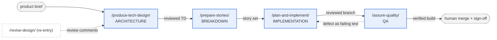
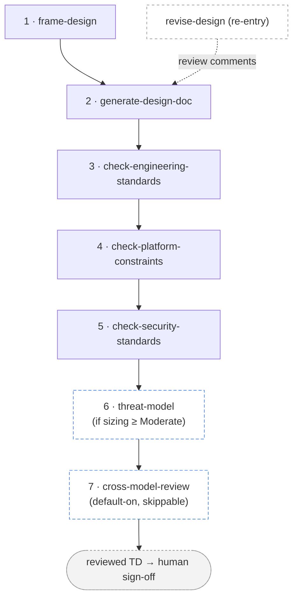
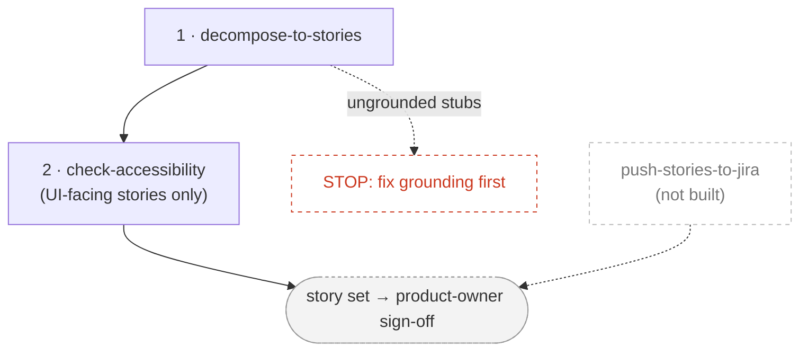
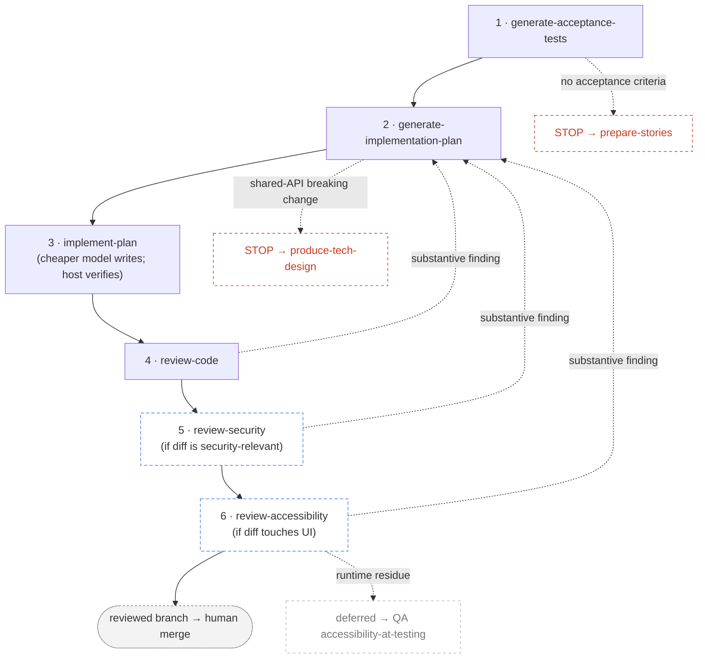
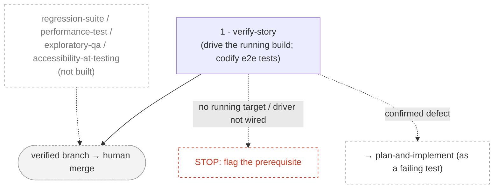

# Composite flows — the pipeline map

The single, current picture of every composite pipeline: what runs, in what order,
which steps are optional, and where a human gates. If you are ever unsure "what
happens when I run `/produce-tech-design`" or "is that step always run", this is the
page.

Each **composite** is a thin recipe that sequences **atomic** skills. The composites
map to the delivery lifecycle, one per phase:

The arc is one-directional (brief → TD → stories → code → verified build), with two
loops back: **review comments** re-enter a TD via `revise-design`, and **confirmed
defects** route from QA back into the dev pipeline as failing tests.

## How to read each step

Every step is tagged with one of five **kinds**:

| Kind | Meaning |
|------|---------|
| **Mandatory** | Runs every time, in order. |
| **Conditional** | Runs only when its input is present (the condition is stated). |
| **Stop / route-back** | A degraded-input guard: the pipeline halts here and routes elsewhere rather than proceeding. |
| **Re-entry** | Invoked outside the linear flow, on demand (not a numbered step). |
| **Named, not built** | A future slot, shown so the full intended sequence is visible. Not run today. |

**The gate is universal.** At every step, each non-trivial change is walked back to you
one at a time — **Accept / Modify / Reject / Defer** — and only what you approve is
written. No composite ever auto-decides. And four things stay **human**, always, across
all composites: the **merge**, **risk acceptance / security sizing**, **sign-off**, and
**accessibility certification**.

---

## `/produce-tech-design` — Architecture

A product brief becomes one reviewed Technical Design. The order is fixed; the
baseline (steps 1-5) always runs, and the two heavy analyses (threat-model,
cross-model-review) are **risk-tiered** — gated on a recorded human decision, never a
silent skip. One shared TD throughout.

| # | Step | Kind | What it adds to the TD |
|---|------|------|------------------------|
| 1 | `frame-design` | **Conditional** | Skip if a framed TD already exists (record the skip). Else: framed TD — scope, NFRs, assumptions, standards, direction. External web research is consent-gated. |
| 2 | `generate-design-doc` | Mandatory | Architecture + **public** API contracts, grounded in real code. Presents an **Approach & key decisions** pre-flight for sign-off before the full draft. |
| 3 | `check-engineering-standards` | Mandatory | GDS Way commitments (GDSW-*). |
| 4 | `check-platform-constraints` | Mandatory (fit) + **conditional** (security) | Verifies the design **fits** the platform's declared constraints (residency, approved services, tenancy, quotas, egress). **Only if** the design introduces/changes a platform component, also security-checks that new surface (cites NCSC CP / A03 / A08 / GDSW-OPS/SCM). |
| 5 | `check-security-standards` | Mandatory | Security checklist + a **proposed** sizing (you accept it, not the skill). The accepted sizing gates step 6. |
| 6 | `threat-model` | **Conditional** (on sizing) | **None/Minor** → record Threat Modeling row as "Not Required" (owner + reason), no STRIDE walk. **Moderate/Major** → run in full: STRIDE register, flips the row, lists open risk decisions. |
| 7 | `cross-model-review` | **Default-on, skippable** | Independent fresh-context critique (runs locally), walked back into the TD. A human may skip a low-risk TD with a recorded reason. |
| ↺ | `revise-design` | Re-entry | Apply a **list of review comments** back into the TD, one at a time. Use after sign-off feedback or any review — not a numbered step. |

**Risk-tiering rule:** a skipped step is always a **recorded, owned decision** in the
Decision & change log, never a silent omission — the composite never decides the tier, the
human does. This caps the heaviest spend (a full STRIDE walk; a separate-context review) on
low-risk TDs while keeping full scrutiny mandatory where the sizing says it matters.

**Not automated:** design approval and risk acceptance (human sign-off).

---

## `/prepare-stories` — Breakdown

A reviewed TD becomes a developer-ready, accessibility-checked, Jira-ready backlog.

| # | Step | Kind | Notes |
|---|------|------|-------|
| 1 | `decompose-to-stories` | Mandatory | TD + requirements → vertical, traceable, Jira-ready stories; gaps walk back into the TD. |
| 2 | `check-accessibility` | **Conditional** | Runs only on the **UI-facing** stories (filtered via each story's "Grounds in" block). Adds WCAG 2.2 AA criteria; flags design-level a11y gaps to the TD. |
| stop | degraded input | Stop / route-back | If step 1 emitted **ungrounded story stubs**, stop before step 2 — a11y can't scope stories it can't ground. Fix grounding first. |
| — | `push-stories-to-jira` | Named, not built | Awaiting an AI-usable Jira path; ticket creation is human today. |

**Not automated:** Jira ticket creation, story sign-off (product owner), accessibility
certification (specialist + audit + AT testing).

---

## `/plan-and-implement` — Implementation

One story becomes reviewed, tested code on a branch. The first pipeline that crosses
the architecture cap downward (writes code), and the model-tiered one.

| # | Step | Kind | Notes |
|---|------|------|-------|
| 1 | `generate-acceptance-tests` | Mandatory | Story criteria → **failing** acceptance tests; you accept them as the oracle. |
| 2 | `generate-implementation-plan` | Mandatory | Story + tests + real code → the plan (the contract); recommends the implementer model. |
| 3 | `implement-plan` | Mandatory | Dispatches the chosen (default cheaper) model to write code to green; the host independently re-verifies the gates. |
| 4 | `review-code` | Mandatory | Independent fresh-context review of the diff (general correctness); trivial fix applied + re-gated, substantive routes back to step 2. |
| 5 | `review-security` | **Risk-tiered** | The **security** lens on the diff (control-cited: realisation gaps + new vulns). Runs when the diff touches a security-sensitive surface or the sizing is Moderate/Major; otherwise records "Not Required". Same gated walk-back. |
| 6 | `review-accessibility` | **Risk-tiered** | The **accessibility** lens on the diff (WCAG SC-cited; statically-detectable failures). Runs when the diff touches a UI surface; otherwise "Not Required". Produces a **deferred-to-AT list** (runtime residue) for the QA `accessibility-at-testing` slot. Same gated walk-back. |
| stop | no oracle | Stop / route-back | Story has no acceptance criteria / is an ungrounded stub → route to `prepare-stories`. |
| stop | shared-API break | Stop / route-back | A breaking change to a shared contract → route to `produce-tech-design` first. |

The three code-level review lenses (general / security / accessibility) are all built; the
two specialised ones are risk-tiered. The running-UI / AT accessibility verification is the
QA-phase `accessibility-at-testing` slot, which consumes review-accessibility's deferred-to-AT list.

**Not automated:** the **merge** (human), security/accessibility certification, shared-API
breaking-change approval (architect, via the TD process).

---

## `/assure-quality` — QA

A built story is verified against its acceptance criteria on the running system, leaving
durable end-to-end tests behind. A phase front door that sequences one atomic today and
grows as more QA atomics are built.

| # | Step | Kind | Notes |
|---|------|------|-------|
| 1 | `verify-story` | Mandatory | Drives the running build per criterion (driver by `kind`: API / browser / simulator); verifies by writing durable e2e tests; classifies env-vs-real failures. |
| ↺ | defect routing | Re-entry | A confirmed product defect routes back to `plan-and-implement` **as a failing test** — QA never fixes product code. |
| stop | no running target | Stop / route-back | No running target (and none can be stood up), or the driver isn't wired for the story's `kind` → stop and flag the prerequisite. |
| — | `regression-suite`, `performance-test`, `exploratory-qa`, `accessibility-at-testing` | Named, not built | The QA phase grows by adding these atomics here. |

**Phase boundary:** QA verifies the **running** build. Code-level review (`review-code`
and the code-level checks) belongs to **implementation**, before QA — not here.

**Not automated:** the **merge**, release sign-off, fixing product code.

---

## Keeping this current

This page is the single source of the pipeline map, so it has to track the composites.
When you change a composite's sequence, add/remove a step, or change a step's
optionality:

1. Update the relevant section here (diagram + table).
2. It's in `docs/authoring.md`'s "before you merge" checklist.
3. `install.sh` runs a drift guard: every composite skill (`kind: composite` in its
   SKILL.md frontmatter) must be named in this file, and it warns if one is missing.
   (That catches a new or renamed composite; it can't catch a stale step inside one —
   that's on the author.)
